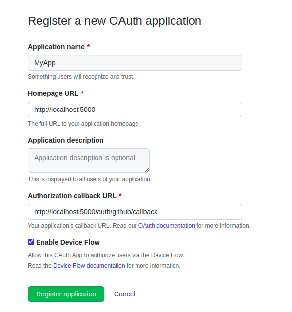

<p align="center">
  <a href="http://nestjs.com/" target="blank"></a>
</p>

[circleci-image]: https://img.shields.io/circleci/build/github/nestjs/nest/master?token=abc123def456
[circleci-url]: https://circleci.com/gh/nestjs/nest

  <p align="center">A progressive <a href="http://nodejs.org" target="_blank">Node.js</a> framework for building efficient and scalable server-side applications.</p>
    <p align="center">
<a href="https://www.npmjs.com/~nestjscore" target="_blank"></a>
<a href="https://www.npmjs.com/~nestjscore" target="_blank"></a>
<a href="https://www.npmjs.com/~nestjscore" target="_blank"></a>
<a href="https://circleci.com/gh/nestjs/nest" target="_blank"></a>
<a href="https://coveralls.io/github/nestjs/nest?branch=master" target="_blank"></a>
<a href="https://discord.gg/G7Qnnhy" target="_blank"></a>
<a href="https://opencollective.com/nest#backer" target="_blank"></a>
<a href="https://opencollective.com/nest#sponsor" target="_blank"></a>
  <a href="https://paypal.me/kamilmysliwiec" target="_blank"></a>
    <a href="https://opencollective.com/nest#sponsor"  target="_blank"></a>
  <a href="https://twitter.com/nestframework" target="_blank"></a>
</p>
  <!--[](https://opencollective.com/nest#backer)
  [](https://opencollective.com/nest#sponsor)-->

## Description

Project allows the users to get authenticated using Github OAuth, giving access to create repositories. The user can then create repositories using the API `/api/repos` by making a post request to it.

Code Implementation Details:
1. `github.strategy.ts` -> Uses Passport Github strategy to authenticate the user.
2. `app.service.ts` -> Uses passport user to set required cookies. This file also contains the API Implementation of creating a repo using GitHub APIs with proper exception handling, validation checks, and response object.
3. `app.module.ts` -> Contains all the configuration, pipelines, etc.
4. `schema` folder -> Contains the request response objects for repo creation process.

This Project is started from [Nest](https://github.com/nestjs/nest) framework TypeScript starter repository. 

## Installation

```bash
$ npm install
```


#### Creating GitHub App

First you have to [register](https://github.com/settings/applications/new) a new OAuth application in GitHub. Fill the details as show here in the image:



### Creating Environment file needed to run the app
Copy the contents from `.env.sample` to `.env` file, and fill the required values.
```
SESSION_SECRET= (Anything random string for encryption)
GITHUB_CLIENT_ID= (Github App created above and add client id from there)
GITHUB_CLIENT_SECRET= (Github App created above and add client secret from there)
```

## Running the app

```bash
# development
$ npm run start

# watch mode
$ npm run start:dev

# production mode
$ npm run start:prod
```

## How it looks


And we see it is created here


## Test

```bash
# unit tests
$ npm run test

# e2e tests
$ npm run test:e2e

# test coverage
$ npm run test:cov
```

## Support

Nest is an MIT-licensed open source project. It can grow thanks to the sponsors and support by the amazing backers. If you'd like to join them, please [read more here](https://docs.nestjs.com/support).

## Stay in touch

- Author - [Kamil Myśliwiec](https://kamilmysliwiec.com)
- Website - [https://nestjs.com](https://nestjs.com/)
- Twitter - [@nestframework](https://twitter.com/nestframework)

## License

Nest is [MIT licensed](LICENSE).
